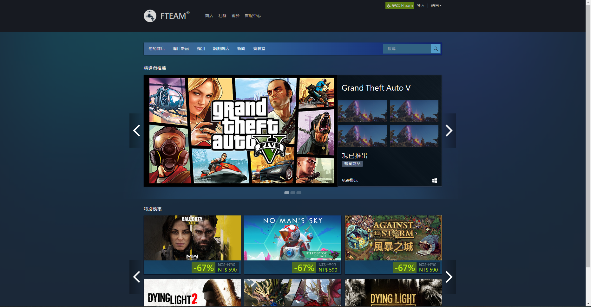

# Steam React
---

簡易版 Steam 前端克隆使用 React、Redux 和 TailwindCSS。
Simple version of Steam front-end clone using React, Redux and TailwindCSS.

> 不屬於 Steam® 版權所有，為 Dalufishe 開發，並不以營利為目的之開源項目。

### 使用應用程序
---

線上版網址: <a href="https://clone-gang.github.io/steam-react/">https://clone-gang.github.io/steam-react/</a>

目前版本 (開發中版本) 為單純頁面克隆，使用假數據，還不具有實際功能。



### 運行所需
--- 
> _注意，以下為開發者文檔_

- Node.js (latest version)
- npm (latest version)

### 運行應用程序
---

- 克隆此專案

```bash
git clone https://github.com/Clone-Gang/steam-react
```

- 下載相關依賴

```bash
npm install
```

- 啟動項目

```bash
npm run start
```

您應該就可以正常正常啟動項目。(本機位置，3000 端口)

### 目錄結構

---

```
.
├─ .gitignore
├─ README.md
├─ docs
│  └─ assets
│     ├─ Screenshot 2023-04-22 114344.png
│     └─ steam-clone.png
├─ package-lock.json
├─ package.json
├─ postcss.config.js
├─ public
│  ├─ favicon.ico
│  ├─ index.html
│  ├─ logo192.png
│  ├─ logo512.png
│  ├─ manifest.json
│  └─ robots.txt
├─ src
│  ├─ App.jsx
│  ├─ api
│  │  ├─ recommended_api.js
│  │  ├─ specialoffers_api.js
│  │  └─ test.rest
│  ├─ assets
│  │  ├─ bg.png
│  │  ├─ logo.png
│  │  └─ sidebar
│  │     ├─ sidebaricons.png
│  │     └─ sidebarimage.png
│  ├─ components
│  │  ├─ DiscountBox
│  │  │  └─ DiscountBox.jsx
│  │  ├─ DiscountBoxSmall
│  │  │  └─ DiscountBoxSmall.jsx
│  │  ├─ FteamSwiper
│  │  │  └─ FteamSwiper.jsx
│  │  └─ StyledContainer
│  │     └─ StyledContainer.jsx
│  ├─ fakedata
│  │  └─ steam_fake_data.js
│  ├─ global.scss
│  ├─ hooks
│  │  ├─ useHover.js
│  │  └─ useRandom.js
│  ├─ index.js
│  ├─ layout
│  │  ├─ AboutApp
│  │  │  └─ AboutApp.jsx
│  │  ├─ BrowseCat
│  │  │  └─ BrowseCat.jsx
│  │  ├─ BrowseFtm
│  │  │  └─ BrowseFtm.jsx
│  │  ├─ Categories
│  │  │  └─ Categories.jsx
│  │  ├─ Event
│  │  │  └─ Event.jsx
│  │  ├─ HotVR
│  │  │  └─ HotVR.jsx
│  │  ├─ Navbar
│  │  │  ├─ Navbar.jsx
│  │  │  ├─ NavbarLeft
│  │  │  │  └─ NavbarLeft.jsx
│  │  │  ├─ NavbarMiddle
│  │  │  │  ├─ MenuList
│  │  │  │  │  ├─ MenuList.jsx
│  │  │  │  │  └─ MenuListItem
│  │  │  │  │     └─ MenuListItem.jsx
│  │  │  │  └─ NavbarMiddle.jsx
│  │  │  └─ NavbarRight
│  │  │     ├─ Language
│  │  │     │  ├─ Language.jsx
│  │  │     │  └─ languages.json
│  │  │     └─ NavbarRight.jsx
│  │  ├─ Recommended
│  │  │  ├─ Recommended.jsx
│  │  │  └─ RecommendedCard
│  │  │     ├─ RcmImage
│  │  │     │  └─ RcmImage.jsx
│  │  │     ├─ RcmInfomation
│  │  │     │  └─ RcmInfomation.jsx
│  │  │     └─ RecommendedCard.jsx
│  │  ├─ Sidebar
│  │  │  └─ Sidebar.jsx
│  │  └─ SpecialOffers
│  │     ├─ SpecialOffers.jsx
│  │     └─ SpecialOffersCard
│  │        └─ SpecialOffersCard.jsx
│  └─ redux
│     ├─ actions
│     │  └─ language_a.js
│     ├─ reducers
│     │  └─ language_r
│     │     ├─ language.json
│     │     └─ language_r.js
│     └─ store.js
└─ tailwind.config.js
```
©generated by [Project Tree Generator](https://woochanleee.github.io/project-tree-generator)
